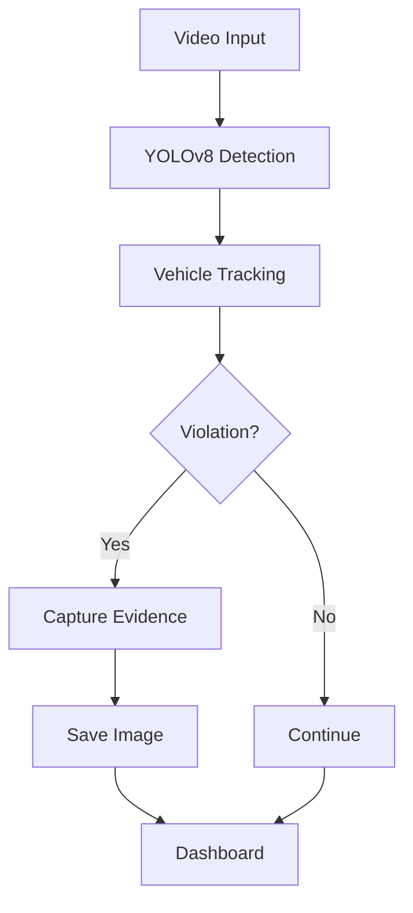

# 🚦 SIRAT AI

<div align="center">

## Smart Integrated Road AI Traffic System

**AI-Powered Traffic Monitoring & Violation Detection System**

> Detect • Analyze • Monitor • Visualize


</div>

---

## 📖 Overview

**SIRAT AI (Smart Integrated Road AI Traffic System)** merupakan sistem pemantauan lalu lintas berbasis Artificial Intelligence yang memanfaatkan **YOLOv8**, **OpenCV**, dan **Flask** untuk mendeteksi pelanggaran lalu lintas secara otomatis, menampilkan hasil secara real-time melalui dashboard web, serta menyimpan bukti pelanggaran.

---

## ✨ Features

| Feature | Status |
|---------|:------:|
| Vehicle Detection | ✅ |
| Crosswalk Violation | ✅ |
| Centerline Violation | ✅ |
| Automatic Evidence Capture | ✅ |
| Real-time Dashboard | ✅ |
| Video Upload | ✅ |
| Live Statistics | ✅ |

---

## 🏗️ Architecture

```text
Camera / Video
      │
      ▼
 YOLOv8 Detection
      │
      ▼
Violation Analysis
      │
      ▼
Evidence Capture
      │
      ▼
 Flask + Socket.IO
      │
      ▼
 Web Dashboard
```

---

## 🛠️ Tech Stack

- Python
- Flask
- Flask-SocketIO
- OpenCV
- Ultralytics YOLOv8
- HTML5
- CSS3
- JavaScript

---

## 📂 Project Structure

```text
SIRAT-AI/
├── app.py
├── model/
├── static/
├── templates/
├── violations/
├── requirements.txt
└── README.md
```

---

## 🚀 Installation

```bash
git clone https://github.com/Fahri-DLLAJ/SIRAT-AI.git
cd SIRAT-AI

pip install -r requirements.txt

python app.py
```

Open:

```
http://127.0.0.1:5000
```

---

## 🔄 Workflow



---

## 📈 Roadmap

- Smart Traffic Light Integration
- Emergency Vehicle Priority
- License Plate Recognition (ANPR)
- Cloud Database
- Mobile Application
- AI Traffic Density Prediction

---

## 👨‍💻 Author

**M. Fahri Firnando**

SMK Negeri 2 Klaten

GitHub: https://github.com/Fahri-DLLAJ

---

<div align="center">

### ⭐ Don't forget to give this repository a Star!

Made with ❤️ using Flask, OpenCV, and YOLOv8.

</div>
